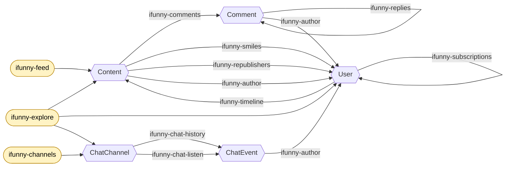

# psyduck-etl/ifunny

An [iFunny](https://ifunny.co) data-source plugin for the
[Psyduck](https://github.com/gastrodon/psyduck) ETL engine. It exposes the
iFunny content graph — posts, comments, users, and public chat channels — as
Psyduck producers and transformers, shaped so that a discovery pipeline can
feed into itself: user profiles yield posts, posts yield comments, posts and
comments yield the users who interacted with them, and those users yield more
profiles.

Built against the SDK v0.5.0 in-process plugin API and the extended
[ifunny-go](https://github.com/open-ifunny/ifunny-go) client.

## Loading

```hcl
plugin "ifunny" {
  source = "https://github.com/psyduck-etl/ifunny"
}
```

`psyduck init` fetches and builds the plugin as a `-buildmode=plugin` shared
object; `psyduck run` loads it. The plugin and the host must be built with the
same Go toolchain and matching `psyduck-etl/sdk` version — this is a hard
constraint of Go plugins.

## Authentication

Every API-backed resource requires:

| Option | Description |
| --- | --- |
| `bearer-token` | OAuth bearer token to authenticate with |
| `user-agent` | user agent to make requests as |

Both are typically wired from the environment, e.g. `bearer-token =
env.IFUNNY_BEARER`.

## Rate limiting and cutoffs

`per-minute` and `stop-after` are **host-owned** block attributes under SDK
v0.5.0 — set them on any producer or consumer block and the host enforces
them; resources here do not declare them. The one exception is
`ifunny-chat-listen`, which declares its own `stop-after` to tear down its
live websocket subscription cleanly (a live subscription has no natural end).

## The discovery graph

### Explain-it-like-I'm-five

It's following breadcrumbs. You start somewhere public — a **feed**, an
**explore** page, or a list of **chat channels** — and that hands you posts,
users, or rooms. From there every step points you at more entities:

- From a **post** you can reach the people who commented, smiled, or reposted
  it, and the comments themselves.
- From a **person** you can reach their posts (their timeline) and who follows
  them / who they follow.
- From a **chat room** you can reach its messages, and every message points
  back at the person who sent it.

Every *person* you turn up is a fresh starting point, so the graph keeps
feeding itself: posts → people → their posts → their commenters → … The
`ifunny-author` step is the glue — it turns a post, comment, or chat message
into the `{id, nick}` of the person behind it. The `ifunny-lookup-*` steps do
the opposite of discovery: they swap a lightweight reference (just an id or a
channel name) for the full object when you need all of its fields.

### The map

Boxes are entities (what flows through the pipeline as JSON); edges are the
producers/transformers that take you from one to the next.



The join key on each edge is the field you extract from the upstream entity
(with the stdlib `zoom`/`snippet` transformers, or `ifunny-author`) to
parameterize the next producer — e.g. `Content.id` seeds `ifunny-comments`,
`Content.creator.id` (via `ifunny-author`) seeds `ifunny-timeline`. See the
per-resource "Chain in from" column below.

## Producers

All producers emit JSON entities from the iFunny API. Options listed are in
addition to the shared `bearer-token` / `user-agent`.

| Resource | Options | Emits | Chain in from |
| --- | --- | --- | --- |
| `ifunny-feed` | `feed` | Content | — (seed) |
| `ifunny-timeline` | `user`, `by-nick` | Content | `User.id` (or `.nick` with `by-nick`) |
| `ifunny-explore` | `compilation`, `kind` | Content / User / ChatChannel | — (seed) |
| `ifunny-comments` | `content` | Comment | `Content.id` |
| `ifunny-replies` | `content`, `comment` | Comment | `Comment.cid` + `Comment.id` |
| `ifunny-smiles` | `content` | User | `Content.id` |
| `ifunny-republishers` | `content` | User | `Content.id` |
| `ifunny-subscribers` | `user` | User | `User.id` |
| `ifunny-subscriptions` | `user` | User | `User.id` |
| `ifunny-channels` | `query` | ChatChannel | — (seed) |
| `ifunny-chat-history` | `channel` | ChatEvent | `ChatChannel.name` |
| `ifunny-chat-listen` | `channel`, `stop-after` | ChatEvent | `ChatChannel.name` |

Notes:

- **`ifunny-feed`** `feed` names a global feed such as `featured` or
  `collective`. (iFunny serves the `collective` feed over `POST` where every
  other feed is a `GET`; the client handles that quirk, so `feed =
  "collective"` just works.)
- **`ifunny-timeline`** pulls a user's posts. `by-nick = true` treats `user`
  as a nick rather than an id.
- **`ifunny-explore`** `kind` is one of `content`, `user`, `chat` and must
  match the compilation (e.g. `content_top_today` with `content`,
  `users_top_overall` with `user`, `chats_popular_last_week` with `chat`).
- **`ifunny-channels`** with an empty `query` (the default) yields trending
  public channels; a non-empty `query` searches open channels.
- **`ifunny-chat-history`** backfills a channel's message history over the
  chat websocket. **`ifunny-chat-listen`** streams live events; set its
  `stop-after` to bound collection (0 listens until the process exits).

## Transformers

| Resource | Options | In → Out |
| --- | --- | --- |
| `ifunny-author` | — | Content / Comment / ChatEvent → `{id, nick}` |
| `ifunny-lookup-content` | — | `{id}` → full Content |
| `ifunny-lookup-user` | `by-nick` | `{id}` (or `{nick}`) → full User |
| `ifunny-lookup-channel` | — | `{name}` → full ChatChannel |

- **`ifunny-author`** extracts the author reference from any entity that has
  one — content (`creator`), comments and chat events (`user`) — emitting the
  `{id, nick}` seed the user-oriented producers consume. Entities with no
  author are dropped from the pipeline.
- **`ifunny-lookup-*`** hydrate a lightweight reference into the full entity.
  A not-found user (for `ifunny-lookup-user`) drops the datum rather than
  failing the pipeline.

## Chaining across pipelines

A producer takes a fixed id, so walking the graph means turning one
pipeline's output into the next pipeline's producer. Two host mechanisms make
this work:

- **Queue coupling** — one pipeline's consumer writes to a queue (e.g. the
  `amqp` plugin) that another pipeline's producer reads.
- **`produce-from`** — a pipeline renders `produce "..." { ... }` HCL blocks
  (with the stdlib `sprintf` transformer) onto a queue; a second pipeline
  binds a queued block as a dynamic producer.

> The host currently binds only the **first** block a `produce-from` seed
> yields, so one run advances one hop. Re-run to continue, or raise the seed
> producer's `stop-after` once the host drains multiple blocks.

See [`examples/`](./examples) for runnable pipelines:

- [`explore-to-comments`](./examples/explore-to-comments/main.psy) — explore
  → content → comments.
- [`content-to-users`](./examples/content-to-users/main.psy) — feed → users
  who smiled → their timelines.
- [`chat-discovery`](./examples/chat-discovery/main.psy) — trending channels
  → message history → authors.

## Development

```sh
go test ./...                       # assembly + pure-function tests
go vet ./...
go build ./...                      # portable link check
go build -buildmode=plugin -o ifunny.so .   # against the host's Go toolchain
```

The tests cover the resource assembly (names, kinds, specs) and the
pure-function transformer logic. Everything network-facing requires a live
API and is not exercised in CI.
