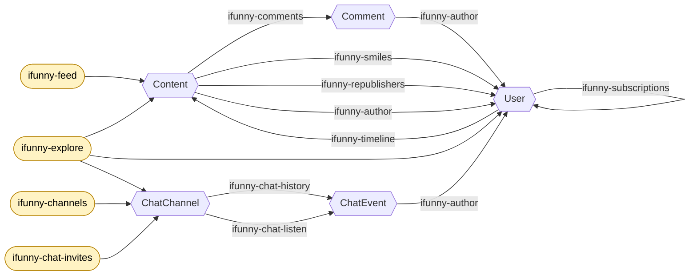

# psyduck-etl/ifunny

An [iFunny](https://ifunny.co) data-source plugin for the
[Psyduck](https://github.com/gastrodon/psyduck) ETL engine. It exposes the
iFunny content graph — posts, comments, users, and public chat channels — as
Psyduck producers and transformers, shaped so that a discovery pipeline can
feed into itself: user profiles yield posts, posts yield comments, posts and
comments yield the users who interacted with them, and those users yield more
profiles.

Built against the [psyduck-etl/sdk](https://github.com/psyduck-etl/sdk) gRPC
plugin API (see `go.mod` for the exact version) and the extended
[ifunny-go](https://github.com/open-ifunny/ifunny-go) client.

## Loading

```hcl
plugin "ifunny" {
  source = "https://github.com/psyduck-etl/ifunny"
}
```

`psyduck init` fetches and builds the plugin as a plain executable;
`psyduck run` launches it as a subprocess and speaks gRPC to it (`sdk/rpc`).
No toolchain or dependency-graph matching between the plugin and the host is
required — only wire-protocol compatibility (`rpc.Handshake.ProtocolVersion`).

## Authentication

Every API-backed resource takes a `user-agent` block plus exactly one of two
mutually-exclusive auth modes:

| Option | Type | Access |
| --- | --- | --- |
| `auth-bearer` | string | A logged-in user's OAuth token — full access. **Required by the chat resources** (`ifunny-chat-*`), whose WAMP connection authenticates with a bearer ticket. |
| `auth-basic` | string | Anonymous read-only REST access. Value is one of: a literal already-primed basic token, `"generate"` (mint + prime one at bind time), or `"generate-cache"` (mint + prime once, then reuse across runs). |
| `user-agent` | block | Device profile that renders the request user-agent. Required for every auth mode. |

Tokens are typically wired from the environment, e.g. `auth-bearer =
env.IFUNNY_BEARER`. Setting both `auth-basic` and `auth-bearer` (or neither)
errors at bind time — the mutex is enforced, no implicit priority.

### The `user-agent` block

```hcl
user-agent {
  device         = "android"   # required, one of: android, ios
  device-version = "14"        # required, e.g. "14" (android) or "17.5.1" (ios)
  app-version    = ""          # optional, defaults to ifunny-go's pinned APP_VERSION
  app-build      = ""          # optional, defaults to ifunny-go's pinned APP_BUILD
}
```

The block renders a mobile user-agent identical in shape to the ones
`ifunny-go`'s `Android{}` / `IOS{}` types produce. Brand and model are fixed
(`google` / `Pixel 8`, `Apple` / `iPhone 15 Pro`) — only the OS and app
version tokens are caller-controllable.

### `auth-basic` values

A **basic token** is iFunny's anonymous credential: a base64 value derived
from a random UUID and the app client id/secret, then "primed" by one
authenticated call before it grants read access. It covers the REST discovery
producers and lookups but **not** the chat resources.

- **Literal token** (e.g. `auth-basic = env.IFUNNY_BASIC`): treated as
  already primed; no handshake at bind time.
- **`"generate"`**: mint and prime a fresh token every startup. Costs a
  one-time ~15s handshake against the API per run.
- **`"generate-cache"`**: mint and prime once, then persist the primed
  token to `$XDG_CACHE_HOME/psyduck-ifunny/basic-token` (falling back to
  `~/.cache/psyduck-ifunny/basic-token`) so subsequent runs load the file
  and skip the handshake. To invalidate — e.g. if the token starts failing
  — delete the cache file and the next run will re-mint.

## Rate limiting and cutoffs

`per-minute` and `stop-after` are **host-owned** block attributes under SDK
v0.5.2 — set them on any producer or consumer block and the host enforces
them; resources here do not declare them. This includes the live-subscription
chat resources (`ifunny-chat-listen`, `ifunny-chat-invites`): the host's
`flow.Producer` wrapper cancels their ctx at the cutoff and the loops
unsubscribe cleanly via `ctx.Done`. Requires a psyduck host with
[gastrodon/psyduck#29](https://github.com/gastrodon/psyduck/pull/29) — older
hosts leave the websocket pinned open past the cutoff.

## The discovery graph

### Explain-it-like-I'm-five

It's following breadcrumbs. You start somewhere public — a **feed**, an
**explore** page, or a list of **chat channels** — and that hands you posts,
users, or rooms. From there every step points you at more entities:

- From a **post** you can reach the people who commented, smiled, or reposted
  it, and the comments themselves.
- From a **person** you can reach their posts (their timeline) and who follows
  them / who they follow.
- From a **chat room** you can reach its messages, and every message points
  back at the person who sent it.

Every *person* you turn up is a fresh starting point, so the graph keeps
feeding itself: posts → people → their posts → their commenters → … The
`ifunny-author` step is the glue — it turns a post, comment, or chat message
into a user reference (an `{id, nick}` json object, or a bare id string). The
`ifunny-content` / `ifunny-user` / `ifunny-channel` steps do the opposite of
discovery: they swap a lightweight reference (just an id or a channel name)
for the full object when you need all of its fields.

### The map

Boxes are entities (what flows through the pipeline as JSON); edges are the
producers/transformers that take you from one to the next.



The join key on each edge is the field you extract from the upstream entity
(with the stdlib `zoom`/`snippet` transformers, or `ifunny-author`) to
parameterize the next producer — e.g. `Content.id` seeds `ifunny-comments`,
`Content.creator.id` (via `ifunny-author`) seeds `ifunny-timeline`. See the
per-resource "Chain in from" column below.

## Producers

All producers emit entities from the iFunny API, encoded via their `emit`
field (default `"json"`). Options listed are in addition to the shared auth
options (see [Authentication](#authentication)) and `emit`.

| Resource | Options | Emits | Chain in from |
| --- | --- | --- | --- |
| `ifunny-feed` | `feed` | Content | — (seed) |
| `ifunny-timeline` | `by-id`, `by-nick` (mutex) | Content | `User.id` or `User.nick` |
| `ifunny-explore` | `compilation`, `kind` | Content / User / ChatChannel | — (seed) |
| `ifunny-comments` | `content` | Comment (forest: top-level then each comment's replies) | `Content.id` |
| `ifunny-smiles` | `content` | User | `Content.id` |
| `ifunny-republishers` | `content` | User | `Content.id` |
| `ifunny-subscribers` | `user` | User | `User.id` |
| `ifunny-subscriptions` | `user` | User | `User.id` |
| `ifunny-channels` | `query` | ChatChannel | — (seed) |
| `ifunny-chat-history` | `channel` | ChatEvent | `ChatChannel.name` |
| `ifunny-chat-listen` | `channel` | ChatEvent | `ChatChannel.name` |
| `ifunny-chat-invites` | — | ChatChannel | — (seed; `auth-bearer` only) |

Notes:

- **`ifunny-feed`** `feed` names a global feed such as `featured` or
  `collective`. (iFunny serves the `collective` feed over `POST` where every
  other feed is a `GET`; the client handles that quirk, so `feed =
  "collective"` just works.)
- **`ifunny-timeline`** pulls a user's posts. Set exactly one of `by-id`
  (a user id) or `by-nick` (a nick); the resource errors at bind time if
  both or neither is set.
- **`ifunny-explore`** `kind` is one of `content`, `user`, `chat` and must
  match the compilation (e.g. `content_top_today` with `content`,
  `users_top_overall` with `user`, `chats_popular_last_week` with `chat`).
- **`ifunny-comments`** walks the comment forest depth-first: it emits
  each top-level comment and then, before advancing, drains that
  comment's replies (when `comment.num.replies > 0`). One stream
  therefore carries the whole thread; there is no separate replies
  producer.
- **`ifunny-channels`** with an empty `query` (the default) yields trending
  public channels; a non-empty `query` searches open channels. Trending is
  a one-shot fetch (no pagination), served through the same result-iterator
  contract as the query search — see `IterChannelsTrending` in ifunny-go
  v0.1.3+.
- **`ifunny-chat-history`** backfills a channel's message history over the
  chat websocket. **`ifunny-chat-listen`** streams live events; set the
  block-level `stop-after` to bound collection.
- **`ifunny-chat-invites`** streams `ChatChannel`s the logged-in user is
  invited to. Requires `auth-bearer` (anonymous clients receive no
  invites); bound the run with block-level `stop-after`.

## Transformers

Every transformer takes the shared auth surface (see
[Authentication](#authentication)) plus two codec fields:

| Field | Default | Meaning |
| --- | --- | --- |
| `accept` | `"json"` | Encoding of records the transformer *decodes*. `"json"` = a rich object trusted only insofar as we find it useful (missing fields fall back to a fetch by the source's own terminal ref). `"string"` = a bare terminal ref of the source; a fetch is always required to obtain intermediates. |
| `emit` | `"json"` | Encoding of records the transformer *emits*. `"json"` = the fully-hydrated target — always fetched fresh; incoming rich objects are never re-emitted verbatim. `"string"` = the target's terminal ref, no hydration. |

| Resource | Options (beyond accept/emit) | S → T |
| --- | --- | --- |
| `ifunny-author` | `source` **(required)** — one of `"content"`, `"comment"`, `"chat"`; `emit-by = "id"` (default) or `"nick"` | Content / Comment / ChatEvent → User (S picked at bind by `source`) |
| `ifunny-tags` | — | Content → `{"tags": [...]}` (json emit only) |
| `ifunny-content` | — | Content ref → Content |
| `ifunny-user` | `by = "id"` (default) or `"nick"` | User ref → User |
| `ifunny-channel` | — | Channel ref → ChatChannel |

`ifunny-author`'s `source` picks which entity type the transformer will
decode — one transformer instance handles one source, matching the
upstream producer's shape. `"comment"` and `"chat"` sources have no
fetch-by-ref endpoint on the client surface, so `accept = "string"` is
rejected at bind for them.

`ifunny-author`'s `emit-by` and `ifunny-user`'s `by` name the user
reference axis the transformer uses end-to-end: which field of the
input shadow (`creator.id` vs `creator.nick`, or `id` vs `nick`) is
read as the target ref, which endpoint hydrates the target
(`compose.UserByID` vs `compose.UserByNick`), and — under sparse emit —
what is written out. `"id"` and `"nick"` are the only valid values;
anything else errors at bind time.

Op count per accept×emit cell (S = source entity, T = target entity):

| accept → emit | sparse (`string`) | rich (`json`) |
| --- | --- | --- |
| **sparse** (`string`) | S≠T: 1 fetch (source, extract target ref); by-nick recovery adds 1 fetch when the source lacks a nick. S=T: **bind error** — no-op. | S≠T: 1 fetch (source) + 1 fetch (target); recovery may short-circuit the target fetch. S=T: 1 fetch (target). |
| **rich** (`json`) | 0 fetches on the fast path (target ref present in the shadow); by-nick recovery adds 1 fetch when the shadow has an id but no nick. | 1 fetch (target hydrated fresh); by-nick recovery short-circuits — the recovery fetch *is* the emitted target. |

Bind-time errors:

- `ifunny-tags` with `emit = "string"` — a tag list has no terminal ref.
- `ifunny-author` with `source = "comment"` or `"chat"` and `accept =
  "string"` — no single-item fetch endpoint exists for those sources.
- `ifunny-content`, `ifunny-channel`, and `ifunny-user` (either `by`
  mode) with `accept = emit = "string"` — identity, zero ops. The
  reference axis (id or nick) stays consistent throughout the pipeline,
  so a sparse→sparse pass is always a no-op.

Runtime behavior notes:

- **`ifunny-author`** extracts the author reference from the source
  entity picked by `source` (required — no default): `"content"` reads
  `creator`, `"comment"` reads `user`, `"chat"` reads `user` (with the
  chat-event inner `"user"` id-tag). One instance handles one source.
  `emit-by` (default `"id"`) picks the reference axis: `"id"` reads/emits the numeric user
  id, `"nick"` reads/emits the nickname. Sparse emit produces the bare
  id (or nick); rich emit fetches the full User keyed on the same
  axis. Under `emit-by = "nick"`, if the source omits the nick but has
  the id, the transformer recovers by fetching the user by id — and
  reuses that fetch as the emit target on the rich-out cell. Entities
  with no author are dropped from the pipeline.
- **`ifunny-tags`** lifts a post's tag list as `{"tags": [...]}`. Posts with
  no tags are dropped. Missing `tags` key on a rich input triggers a
  content-by-id fallback fetch. See
  [Tag aggregation](#tag-aggregation) for how this feeds a tag census.
- **`ifunny-content` / `ifunny-user` / `ifunny-channel`** hydrate (or
  extract) a lightweight reference. A not-found target drops the datum
  rather than failing the pipeline.
- All five transformers require auth — the same
  `auth-basic` / `auth-bearer` + `user-agent` surface producers take.

## Chaining across pipelines

A producer takes a fixed id, so walking the graph means turning one
pipeline's output into the next pipeline's producer. Two host mechanisms make
this work:

- **Queue coupling** — one pipeline's consumer writes to a queue (e.g. the
  `amqp` plugin) that another pipeline's producer reads.
- **`produce-from`** — a pipeline renders `produce "..." { ... }` HCL blocks
  (with the stdlib `sprintf` transformer) onto a queue; a second pipeline
  binds a queued block as a dynamic producer.

> The host currently binds only the **first** block a `produce-from` seed
> yields, so one run advances one hop. Re-run to continue, or raise the seed
> producer's `stop-after` once the host drains multiple blocks.

Each resource's godoc comment carries a runnable HCL `Example:` block — see
the package doc at [`doc.go`](./doc.go) for the full inventory.

## Tag aggregation

`ifunny-tags` is the front of a tag-census loop: pull posts from any content
producer, lift their tags, track what's been seen in a store, and (eventually)
feed a queue of tags worth searching. The store side is the
[`mysql`](https://github.com/psyduck-etl/mysql) plugin:

- **`mysql-table`** (consumer) `INSERT IGNORE`s a row per record — a distinct
  set of seen tags.
- **`mysql-filter`** (transformer) drops records already in the table and
  passes new ones — i.e. the *newly seen* tags, which is what you'd queue up to
  search next.

One wrinkle worth knowing up front: both `mysql-table` and `mysql-filter`
operate on **one scalar field per record** (`fields = ["tag"]` → a record
shaped `{"tag": "cats"}`). `ifunny-tags` emits the whole list as one record
(`{"tags": [...]}`) and doesn't fan a post's N tags into N records. So between
`ifunny-tags` and the per-tag mysql stages you need an **explode** step — one
record per tag — which psyduck has no primitive for yet. Options, cheapest
first:

1. Store the array whole (`mysql-table` with a JSON/text column) and aggregate
   counts in SQL (`GROUP BY` over an unnested tags column).
2. An explode transformer (the channel-based Transformer contract supports
   1-to-many, so this is now just a stdlib/plugin feature, not a core change).

Instance **counts** ("how many times a tag has been seen") likewise aren't what
`mysql-table` records today — `INSERT IGNORE` tracks distinct existence, not a
tally; counting needs `INSERT … ON DUPLICATE KEY UPDATE n = n + 1` upstream in
the `mysql` plugin. Flagging both so the census math is clear before you wire a
database.

## Development

```sh
go test ./...                       # assembly + pure-function tests
go vet ./...
go build -o ifunny .                # what `psyduck init` runs
```

The tests cover the resource assembly (names, kinds, specs) and the
pure-function transformer logic. Everything network-facing requires a live
API and is not exercised in CI.
